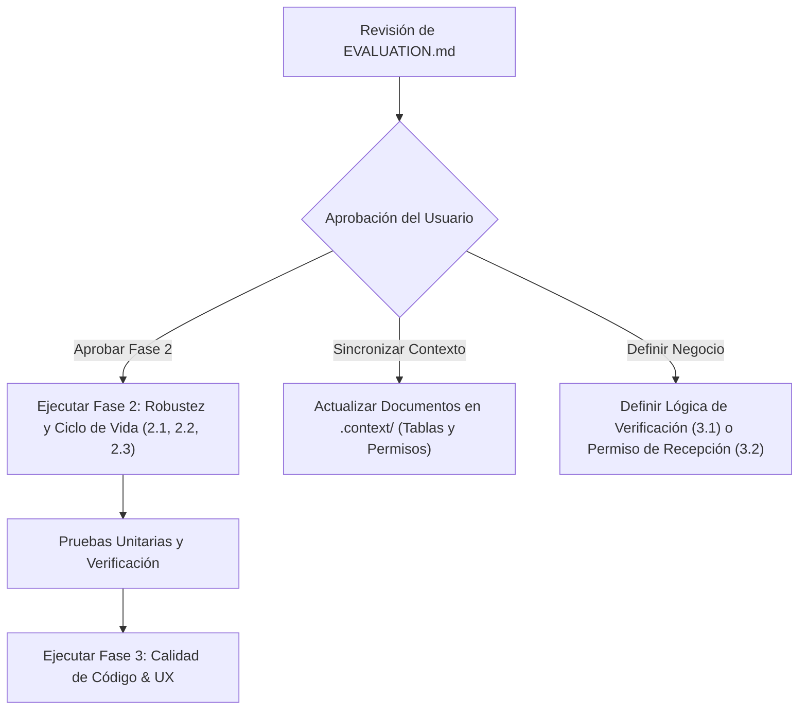

# Evaluación y Puntos Pendientes de SigoAPP

Este documento consolida el estado actual derivado del análisis exhaustivo de arquitectura, diseño y prácticas implementadas en el proyecto **SigoAPP** (especialmente en el módulo de Inventario y su alineación con el backend Spring Boot / Oracle), detallando exclusivamente **aquellos elementos pendientes por resolver**, clasificados por prioridad, tipo de acción y estado de definición.

---

## 1. Resumen Ejecutivo de Estado Pendiente

| Bloque | Pendientes Técnicos | Pendientes de Definición Funcional | Total Pendientes |
| :--- | :---: | :---: | :---: |
| **Fase 2: Alto / Robustez y Ciclo de Vida** | 3 | 0 | 3 |
| **Fase 3: Medio / Calidad de Código & UX** | 5 | 0 | 5 |
| **Fase 4: Menor / Estandarización** | 1 | 0 | 1 |
| **Definición de Negocio y Permisos** | 0 | 3 | 3 |
| **Sincronización de Documentación (`.context/`)** | 3 | 0 | 3 |
| **Total General** | **12** | **3** | **15** |

---

## 2. Puntos Pendientes Técnicos por Resolver

### 2.1 Prioridad Alta (Fase 2: Robustez y Ciclo de Vida)

#### [PENDIENTE] 2.1 Desacoplar `loadTransfers()` del Constructor de `TransferApprovalProvider`
- **Archivo afectado:** [transfer_approval_provider.dart](file:///f:/Juan_Camilo_Diaz/Projects/APP_Gestion_Administrativa/SigoAPP/lib/providers/transfer_approval_provider.dart#L10-L12) y [main.dart](file:///f:/Juan_Camilo_Diaz/Projects/APP_Gestion_Administrativa/SigoAPP/lib/main.dart#L90)
- **Problema:** El constructor de `TransferApprovalProvider` ejecuta automáticamente `loadTransfers()` al inicializarse en el árbol global de `MultiProvider`. Esto dispara una petición asíncrona antes de que el usuario inicie sesión o sin token JWT válido en implementaciones HTTP.
- **Solución requerida:**
  1. Remover la invocación directa `loadTransfers();` del constructor de [TransferApprovalProvider](file:///f:/Juan_Camilo_Diaz/Projects/APP_Gestion_Administrativa/SigoAPP/lib/providers/transfer_approval_provider.dart).
  2. Confirmar que la carga explícita se mantenga delegada al `initState` mediante `addPostFrameCallback` en [transfer_approval_screen.dart](file:///f:/Juan_Camilo_Diaz/Projects/APP_Gestion_Administrativa/SigoAPP/lib/screens/transfer_approval_screen.dart).

#### [PENDIENTE] 2.2 Feedback Visual de Carga y Error en `TransferApprovalScreen`
- **Archivo afectado:** [transfer_approval_screen.dart](file:///f:/Juan_Camilo_Diaz/Projects/APP_Gestion_Administrativa/SigoAPP/lib/screens/transfer_approval_screen.dart#L43-L60)
- **Problema:** Si `provider.loading` está activo o si `provider.error` contiene un mensaje de fallo de red, la UI solo muestra el texto `"No hay solicitudes que coincidan con los filtros"`. No existe retroalimentación de progreso ni opción para reintentar la operación.
- **Solución requerida:**
  1. Mostrar un `CircularProgressIndicator` centrado cuando `provider.loading == true` y la lista esté vacía.
  2. Mostrar un banner o widget descriptivo de error con botón **"Reintentar"** (`provider.loadTransfers()`) cuando `provider.error != null`.

#### [PENDIENTE] 2.3 Inyección Configurable de `TransferRepository` en `main.dart`
- **Archivo afectado:** [main.dart](file:///f:/Juan_Camilo_Diaz/Projects/APP_Gestion_Administrativa/SigoAPP/lib/main.dart#L50-L52)
- **Problema:** `main.dart` instancia de forma rígida `MockTransferRepository(inventoryService)`. Los demás repositorios (`inventoryRepository`, `catalogRepository`, `authRepository`, `geolocationRepository`, `physicalCountRepository`) ya consumen `Http*Repository` conectado a `backendDio`.
- **Solución requerida:**
  1. Permitir alternar entre [MockTransferRepository](file:///f:/Juan_Camilo_Diaz/Projects/APP_Gestion_Administrativa/SigoAPP/lib/repositories/mock_transfer_repository.dart) y [HttpTransferRepository](file:///f:/Juan_Camilo_Diaz/Projects/APP_Gestion_Administrativa/SigoAPP/lib/repositories/http_transfer_repository.dart) mediante una variable de entorno en `.env` (ej. `USE_MOCK_TRANSFERS=true|false`).
  2. Conectar [HttpTransferRepository](file:///f:/Juan_Camilo_Diaz/Projects/APP_Gestion_Administrativa/SigoAPP/lib/repositories/http_transfer_repository.dart) con `backendDio` cuando el backend esté en ejecución.

---

### 2.2 Prioridad Media (Fase 3: Calidad de Código, UX y Mantenibilidad)

#### [PENDIENTE] 3.1 Centralización de Utilidades de Geolocalización y Permisos GPS
- **Archivos afectados:**
  - [generator_screen.dart](file:///f:/Juan_Camilo_Diaz/Projects/APP_Gestion_Administrativa/SigoAPP/lib/screens/generator_screen.dart)
  - [inventory_screen.dart](file:///f:/Juan_Camilo_Diaz/Projects/APP_Gestion_Administrativa/SigoAPP/lib/screens/inventory_screen.dart)
  - [asset_verification_screen.dart](file:///f:/Juan_Camilo_Diaz/Projects/APP_Gestion_Administrativa/SigoAPP/lib/screens/asset_verification_screen.dart)
- **Problema:** En las tres pantallas existe código duplicado para verificar `Geolocator.isLocationServiceEnabled()`, validar `LocationPermission` (`denied`, `deniedForever`) y capturar la posición actual con timeout.
- **Solución requerida:**
  1. Crear la utilidad `location_utils.dart` en `lib/utils/` con métodos estáticos seguros (`checkAndRequestPermission()`, `determinePosition()`).
  2. Reemplazar la lógica dispersa en las tres pantallas por el llamado a esta utilidad centralizada.

#### [PENDIENTE] 3.2 Limpieza de Textos Técnicos y Leyendas Mock en UI
- **Archivos afectados:** [generator_screen.dart](file:///f:/Juan_Camilo_Diaz/Projects/APP_Gestion_Administrativa/SigoAPP/lib/screens/generator_screen.dart) e [inventory_screen.dart](file:///f:/Juan_Camilo_Diaz/Projects/APP_Gestion_Administrativa/SigoAPP/lib/screens/inventory_screen.dart)
- **Problema:** Se presentan cadenas en la interfaz de usuario como `"(Simulación)"` o `"En Mock se omitió el guardado"`, las cuales son artefactos de desarrollo que degradan la percepción de producción.
- **Solución requerida:**
  1. Condicionar o eliminar mensajes de simulación en diálogos visibles para el usuario final, utilizándolos únicamente bajo banderas de depuración (`kDebugMode`) o sustituyéndolos por mensajes amigables.

#### [PENDIENTE] 3.3 Consistencia de Modelo en `ArticleModel` y Deserialización
- **Archivo afectado:** [article_model.dart](file:///f:/Juan_Camilo_Diaz/Projects/APP_Gestion_Administrativa/SigoAPP/lib/models/article_model.dart#L36-L45)
- **Problema / Alineación Backend:** La tabla principal de activos (`ACTIFIJO`) no maneja coordenadas geográficas; estas se gestionan de forma segregada en la tabla `ACFIGEOL` mediante el ID numérico (`afgeIdre` / `article.id`).
- **Solución requerida:**
  1. Preservar la separación estricta: las coordenadas GPS no deben forzarse en el payload de artículos de `ACTIFIJO`.
  2. Mapear en `ArticleModel.fromJson` los atributos reales disponibles en el endpoint (ej. `estado`, `comentarios`), garantizando que la georreferenciación continúe operando a través de [HttpGeolocationRepository](file:///f:/Juan_Camilo_Diaz/Projects/APP_Gestion_Administrativa/SigoAPP/lib/repositories/http_geolocation_repository.dart).

#### [PENDIENTE] 3.4 Deprecación Formal del Método Redundante `applyTransfer`
- **Archivos afectados:**
  - [transfer_repository.dart](file:///f:/Juan_Camilo_Diaz/Projects/APP_Gestion_Administrativa/SigoAPP/lib/repositories/transfer_repository.dart#L28-L29)
  - [http_transfer_repository.dart](file:///f:/Juan_Camilo_Diaz/Projects/APP_Gestion_Administrativa/SigoAPP/lib/repositories/http_transfer_repository.dart#L99-L106)
- **Problema:** En el backend, al aprobar un traspaso (`PUT /api/v1/traspasos/{id}/procesar` con decisión `'ap'`), el cambio de custodia del activo se aplica automáticamente en base de datos. Por ende, el método `applyTransfer` en el contrato es redundante (actualmente solo retorna un `Future.value()`).
- **Solución requerida:**
  1. Agregar la anotación `@deprecated` formal en el contrato [TransferRepository](file:///f:/Juan_Camilo_Diaz/Projects/APP_Gestion_Administrativa/SigoAPP/lib/repositories/transfer_repository.dart) explicando su obsolescencia y preparar su futura extracción sin romper referencias existentes.

#### [PENDIENTE] 3.5 Evaluación de Reemplazo Global de Contenedores de Error por `SessionErrorBanner`
- **Archivos afectados:**
  - Pantallas del módulo de inventario ([inventory_screen.dart](file:///f:/Juan_Camilo_Diaz/Projects/APP_Gestion_Administrativa/SigoAPP/lib/screens/inventory_screen.dart), [generator_screen.dart](file:///f:/Juan_Camilo_Diaz/Projects/APP_Gestion_Administrativa/SigoAPP/lib/screens/generator_screen.dart), etc.)
  - Pantallas con listas y pestañas ([approval_tab_view.dart](file:///f:/Juan_Camilo_Diaz/Projects/APP_Gestion_Administrativa/SigoAPP/lib/screens/tabs/approval_tab_view.dart), etc.)
- **Problema / Implicación a Evaluar:**
  Actualmente coexisten contenedores simples de error (`Container` con fondo rojo), diálogos modales (`DialogUtils.showErrorDialog`) y `SnackBar`. Se debe evaluar la conveniencia técnica y de experiencia de usuario antes de reemplazar masivamente estos contenedores por un widget global `SessionErrorBanner`, ponderando:
  1. Si para sesión expirada (401/403) es más conveniente un banner no bloqueante en la vista o una interrupción modal/diálogo que impida continuar operando con credenciales caducadas.
  2. Si el interceptor de red ([auth_interceptor.dart](file:///f:/Juan_Camilo_Diaz/Projects/APP_Gestion_Administrativa/SigoAPP/lib/utils/auth_interceptor.dart)) o un listener centralizado en `main.dart` debería capturar el 401/403 y redirigir directamente a Login mediante `AuthUtils.logout(context)` en vez de delegar la presentación a cada pantalla individual.
  3. Consistencia visual entre pantallas con formulario desplazable (`SingleChildScrollView`) vs pantallas basadas en listas (`ListView`).
- **Estado:** Postergado para evaluación posterior a la implementación de `AuthUtils.logout`.

---

### 2.3 Prioridad Baja (Fase 4: Estandarización Menor)

#### [PENDIENTE] 4.1 Estandarización de Notificaciones con `NotificationService`
- **Archivos afectados:** Pantallas del módulo de inventario ([inventory_screen.dart](file:///f:/Juan_Camilo_Diaz/Projects/APP_Gestion_Administrativa/SigoAPP/lib/screens/inventory_screen.dart), [generator_screen.dart](file:///f:/Juan_Camilo_Diaz/Projects/APP_Gestion_Administrativa/SigoAPP/lib/screens/generator_screen.dart), etc.)
- **Problema:** Algunas pantallas invocan directamente `ScaffoldMessenger.of(context).showSnackBar(...)` en lugar de utilizar el servicio centralizado [NotificationService](file:///f:/Juan_Camilo_Diaz/Projects/APP_Gestion_Administrativa/SigoAPP/lib/services/notification_service.dart) inyectado en `main.dart`.
- **Solución requerida:**
  1. Reemplazar invocaciones directas de `ScaffoldMessenger` por métodos unificados (`showSuccess()`, `showError()`, `showWarning()`) de `NotificationService`.

---

## 3. Puntos Pendientes de Definición Funcional (En Pausa / Reglas de Negocio)

Estos puntos dependen de decisiones de negocio y especificaciones que aún no han sido definidas por el equipo:

### 3.1 Lógica de Verificación de Activos (`AssetVerificationScreen`)
- **Archivos involucrados:**
  - [asset_verification_screen.dart](file:///f:/Juan_Camilo_Diaz/Projects/APP_Gestion_Administrativa/SigoAPP/lib/screens/asset_verification_screen.dart)
  - [asset_verification_provider.dart](file:///f:/Juan_Camilo_Diaz/Projects/APP_Gestion_Administrativa/SigoAPP/lib/providers/asset_verification_provider.dart)
- **Estado:** **PAUSADO** a solicitud del usuario (*"no, esto lo he de definir más adelante, aún no cuento con la lógica precisa"*).
- **Aspectos pendientes por definir:**
  1. ¿Contra qué fuente de datos se debe validar el activo escaneado: directamente contra el endpoint `/api/v1/articulos/asignados/{cedula}` o contra un endpoint específico de verificación física?
  2. Definir si la validación compara el responsable escaneado en el QR físico vs. la base de datos, o si valida que el activo pertenezca a la bodega/división del usuario autenticado.
  3. Reconectar o refactorizar [AssetVerificationProvider](file:///f:/Juan_Camilo_Diaz/Projects/APP_Gestion_Administrativa/SigoAPP/lib/providers/asset_verification_provider.dart), el cual actualmente se encuentra desconectado de la pantalla principal.

### 3.2 Posible Separación de Permiso RBAC para Receptores de Traspasos
- **Archivos involucrados:**
  - [auth_provider.dart](file:///f:/Juan_Camilo_Diaz/Projects/APP_Gestion_Administrativa/SigoAPP/lib/providers/auth_provider.dart)
  - [dashboard_screen.dart](file:///f:/Juan_Camilo_Diaz/Projects/APP_Gestion_Administrativa/SigoAPP/lib/screens/dashboard_screen.dart)
  - [transfer_delivery_screen.dart](file:///f:/Juan_Camilo_Diaz/Projects/APP_Gestion_Administrativa/SigoAPP/lib/screens/transfer_delivery_screen.dart)
- **Estado:** **EN ANÁLISIS**.
- **Aspectos pendientes por definir:**
  1. Actualmente se utiliza `aein` (`AppPermission.entregaInventario`) para restringir el acceso general a la pantalla "Entrega / Recepción".
  2. El usuario indicó: *"bloqueemos el permiso a la opción del menú con aein, posiblemente añadamos otro permiso para los receptores"*.
  3. Se debe confirmar con el backend si existirá un código específico (ej. `arin` o similar) para separar a quien entrega de quien recibe, o si ambos continuarán bajo el rol de `aein` diferenciándose internamente por la cédula de origen/destino.

### 3.3 Identificación del Responsable de Bodega y Validación de Renderizado de Firmas en Requisiciones
- **Archivos involucrados:**
  - [requisition_signature_screen.dart](file:///f:/Juan_Camilo_Diaz/Projects/APP_Gestion_Administrativa/SigoAPP/lib/screens/requisition_signature_screen.dart)
  - [requisition_signature_capture_screen.dart](file:///f:/Juan_Camilo_Diaz/Projects/APP_Gestion_Administrativa/SigoAPP/lib/screens/requisition_signature_capture_screen.dart)
  - [requisition_signature_provider.dart](file:///f:/Juan_Camilo_Diaz/Projects/APP_Gestion_Administrativa/SigoAPP/lib/providers/requisition_signature_provider.dart)
  - [requisition_model.dart](file:///f:/Juan_Camilo_Diaz/Projects/APP_Gestion_Administrativa/SigoAPP/lib/models/requisition_model.dart)
- **Estado:** **EN ANÁLISIS / DEFINICIÓN**.
- **Aspectos pendientes por definir:**
  1. **Identificación del Responsable Oficial de Bodega (Firma Salida `SA` y Recibo `RE`):** **RESUELTO**. El backend expuso en `GET /api/v1/requisiciones/{empresa}/{tipoDocumento}/{numero}` los campos `responsableBodega` (`BODEGA.BODERESP` de bodega origen) y `responsableBodegaDestino` (`RESUBODS` de bodega destino, si aplica) con `NULLIF(BODERESP, '.')`. El frontend (`RequisicionDetalle` y `RequisitionSignatureScreen`) consume ambos campos para la inferencia estricta de roles (`isDispatcher` y `isReceiver`), manteniendo fallback por permiso `aein` para bodegas sin encargado asignado.
  2. **Validación del Renderizado y Visualización de la Firma:** Verificar y validar el renderizado de la firma digital estampada (formato base64 PNG exportado por el lienzo `signature`), evaluando tanto su visualización en la aplicación móvil (preview/auditoría) como su renderizado e impresión en los reportes oficiales o comprobantes generados por el backend ERP Oracle.

---

## 4. Puntos Pendientes de Sincronización de Documentación (`.context/`)

De acuerdo con las reglas de [AGENTS.md](file:///f:/Juan_Camilo_Diaz/Projects/APP_Gestion_Administrativa/SigoAPP/.agents/AGENTS.md), tras la aprobación de los cambios de código, se debe actualizar la documentación del proyecto:

| Documento | Estado | Modificación Pendiente Requerida |
| :--- | :---: | :--- |
| [.context/visualizacion_dinamica_dashboard.md](file:///f:/Juan_Camilo_Diaz/Projects/APP_Gestion_Administrativa/SigoAPP/.context/visualizacion_dinamica_dashboard.md#L78) | **Desalineado** | Actualizar la sección de "Entrega / Recepción": cambiar de *"Opción disponible para todo usuario autenticado"* a opción protegida por el permiso **`aein`**. |
| [.context/SigoAPP_Mapa_Modulos.md](file:///f:/Juan_Camilo_Diaz/Projects/APP_Gestion_Administrativa/SigoAPP/.context/SigoAPP_Mapa_Modulos.md#L17) | **Desalineado** | En la tabla de módulos (sección 3) y la tabla de rutas (sección 2.1), actualizar el permiso de `TransferDeliveryScreen` sustituyendo `Autenticado` por **`aein`**. |
| [.context/SigoAPP_Historial_Cambios.md](file:///f:/Juan_Camilo_Diaz/Projects/APP_Gestion_Administrativa/SigoAPP/.context/SigoAPP_Historial_Cambios.md) | **Pendiente** | Agregar entrada registrando el endurecimiento de seguridad con `aein` y la restricción de bodegas destino por división del receptor. |

---

## 5. Plan de Acción y Orden de Ejecución Sugerido

Una vez revisado este reporte, el orden recomendado para continuar es:

