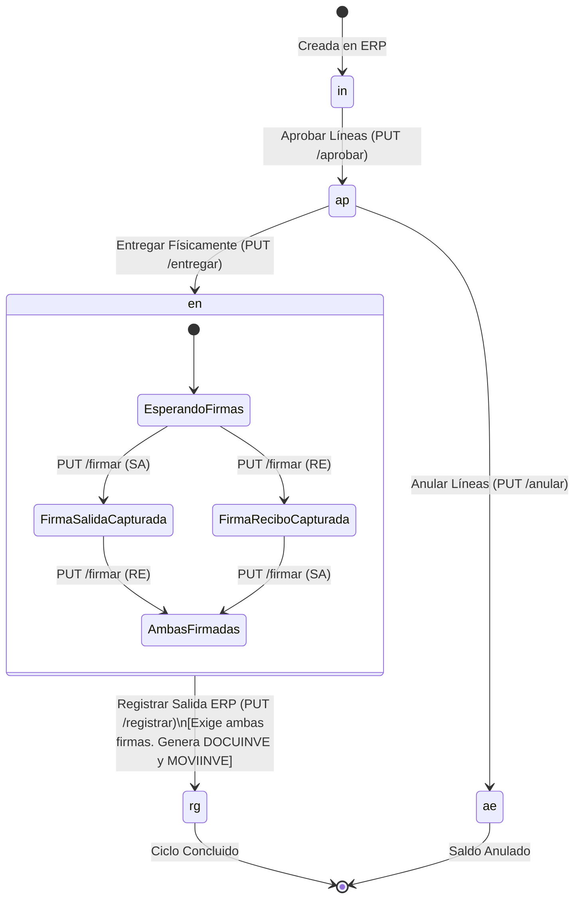

# Documentación Funcional y Técnica: Módulo de Requisiciones de Suministro

**Ubicación de Referencia (UI):** Dashboard Principal -> Botón "Requisiciones" (`RequisitionsScreen`)  
**Versión:** 1.0  
**Fecha:** Septiembre 2026  
**Backend:** Spring Boot (`RequisicionController` / `PKG_FI_REQUISICION`)  

---

## 1. Propósito General del Módulo

El Módulo de Requisiciones gestiona el flujo operativo de despacho de insumos, consumibles y activos devolutivos solicitados internamente por las dependencias de la compañía.

### Principios Fundamentales
1. **La requisición no se crea en la app móvil:** Nace previamente en el ERP en estado inicial (`in`). La app móvil conduce las etapas de revisión, entrega física en bodega, recolección de firmas de custodia y salida definitiva del inventario.
2. **Identificador Natural por Terna:** No existe un ID numérico sintético. La requisición se identifica siempre por su llave compuesta en el ERP:
   $$\text{TERNA} = (\text{empresa}, \text{tipoDocumento}, \text{numero})$$
   - `empresa`: Código de compañía (ej. `"01"`, alfanumérico hasta 6 car.).
   - `tipoDocumento`: Código del tipo de requisición (ej. `"RS"`, alfanumérico hasta 4 car.).
   - `numero`: Número secuencial del documento (ej. `10452`, numérico estricto).
3. **Identificador de Línea:** Dentro de una requisición, cada artículo se identifica de forma única por:
   $$\text{Línea} = (\text{articulo}, \text{bodega}, \text{secuencia})$$
   Un mismo artículo puede figurar en más de una línea si proviene de distinta bodega o secuencia.
4. **Punto de No Retorno:** El movimiento de inventario en el ERP (`DOCUINVE` y `MOVIINVE`) se genera exclusivamente al invocar la acción de **Registrar Salida**. Esta acción es definitiva y requiere obligatoriamente que ambas firmas estén capturadas (`bothSigned == true`). Su ejecución está restringida de forma estricta al responsable titular de la bodega fuente (`responsableBodega`).
5. **Arquitectura Master-Detail y Consulta Protegida (Fail-Fast / Lazy Fetch):**
   - La tabla histórica `MOVIRESU` supera los 100.000 registros. Consultar la API sin fecha (`desde`) es una operación de alto costo que la aplicación móvil no dispara automáticamente en el arranque.
   - Al abrir la pantalla de Requisiciones, la app móvil únicamente carga el catálogo de empresas (`GET /api/v1/empresas/getAll`) y permanece en espera reactiva con ícono de calendario hasta que el operador selecciona una fecha inicial (`desde`).
   - La API `GET /api/v1/requisiciones` entrega la bandeja de **Documentos de Requisición** (`RequisicionResumen`), correspondiente al Nivel 1 (Master).
   - Los movimientos y líneas de artículos (`RequisicionDetalleLinea`) se descargan bajo demanda (Nivel 2 - Detail) únicamente cuando el operador interactúa o expande el documento específico (`GET /api/v1/requisiciones/{empresa}/{tipoDocumento}/{numero}`).

---

## 2. Permisos y Control de Acceso (RBAC)

| Capa | Clave / Código | Condición | Comportamiento |
|---|:---:|---|---|
| **Forma en Base de Datos** | `areq` | Asignado en `FPL_ROLEFORM` | Habilita la tarjeta de acceso "Requisiciones" en el Dashboard de la app móvil. |
| **Enum Cliente (Flutter)** | `AppPermission.requisiciones` | `auth.permisos.hasPermission(...)` | Control de visibilidad en `DashboardScreen`. |
| **Seguridad Backend (Spring)** | `ROLE_ADMIN` | Claim `rol: "ADMIN"` en JWT | Todas las rutas `/api/v1/requisiciones/**` exigen token administrativo de `/api/v1/auth/login`. |

---

## 3. Máquina de Estados (Ciclo de Vida)

En el ERP, la cabecera del documento (`REQUSUMI`) permanece siempre en estado `'ac'`. El estado mostrado en la aplicación es **derivado dinámicamente** del estado de sus líneas (`MOVIRESU`):



### Catálogo de Estados Derivados
| Código | Estado | Descripción Funcional | Acción Habilitada en UI |
|:---:|---|---|---|
| `in` | **Inicial** | Requisición radicada en ERP, pendiente de aprobación en bodega. | Aprobar líneas con cantidades |
| `ap` | **Aprobada** | Líneas autorizadas con cantidades asignadas. | Entregar físicamente o Anular saldo |
| `en` | **Entregada** | Artículos despachados en bodega con placas resueltas. Esperando firmas. | Capturar firma Salida (SA) y Recibe (RE) |
| `ae` | **Anulada al entregar** | Cancelación del saldo aprobado no entregado. | Informativo / Consulta |
| `rg` | **Registrada** | Salida asentada en inventario ERP (`DOCUINVE` / `MOVIINVE`). Proceso completado. | Informativo / Consulta histórica |

---

## 4. Matriz de Endpoints (`RequisicionController`)

Base URL: `/api/v1/requisiciones`  
Cabecera obligatoria: `Authorization: Bearer <TOKEN>`

| Operación | Método | Ruta | Propósito | Request Body |
|---|:---:|---|---|---|
| **1. Tipos Gestionables** | `GET` | `/tipos` | Lista los tipos de documento configurados en `EQUIVALE` | Ninguno |
| **2. Bandeja de Requisiciones** | `GET` | `` | Listado de requisiciones filtrado por estado y parámetros | Query params |
| **3. Detalle Completo** | `GET` | `/{empresa}/{tipoDocumento}/{numero}` | Cabecera, líneas con cantidades y placas, y estado de firmas | Ninguno |
| **4. Aprobar Líneas** | `PUT` | `/{empresa}/{tipoDocumento}/{numero}/aprobar` | Autoriza cantidades de una o más líneas | `RequisicionLineasRequest` |
| **5. Entregar Líneas** | `PUT` | `/{empresa}/{tipoDocumento}/{numero}/entregar` | Sella entrega física y asigna placas (FIFO automático o manual) | `RequisicionLineasRequest` |
| **6. Anular Líneas** | `PUT` | `/{empresa}/{tipoDocumento}/{numero}/anular` | Anula el saldo aprobado de líneas sin entrega | `RequisicionAnularRequest` |
| **7. Registrar Firma** | `PUT` | `/{empresa}/{tipoDocumento}/{numero}/firmar` | Guarda firma manuscrita digital (`SA` o `RE`) | `RequisicionFirmaRequest` |
| **8. Descargar Firma (Imagen)** | `GET` | `/{empresa}/{tipoDocumento}/{numero}/firmas/{tipo}` | Obtiene los bytes de la firma como imagen (`image/png`, etc.) | Ninguno |
| **9. Registrar Salida ERP** | `PUT` | `/{empresa}/{tipoDocumento}/{numero}/registrar` | Asienta la salida definitiva en inventario. Exige 2 firmas | `RequisicionRegistrarRequest?` |

---

## 5. Especificación Detallada de Contratos

### 5.1 Tipos Gestionables: `GET /api/v1/requisiciones/tipos`
Obtiene los tipos de requisición autorizados para operar desde la app móvil. Si este endpoint responde una lista vacía, significa que en la base de datos falta parametrizar la tabla `EQUIVALE`.

#### Respuesta Exitosa (`200 OK`):
```json
{
  "code": 0,
  "msg": "Consulta exitosa",
  "data": [
    {
      "codigo": "RS",
      "nombre": "REQUISICION DE SUMINISTROS"
    },
    {
      "codigo": "RP",
      "nombre": "REQUISICION DE PAPELERIA"
    }
  ]
}
```

---

### 5.2 Bandeja de Requisiciones: `GET /api/v1/requisiciones`
Devuelve la bandeja filtrada por estado.

#### Parámetros Query:
* `estado` (*String*, opcional): `in`, `ap`, `en`, `rg`, `ae`.
* `empresa` (*String*, opcional): Código de la empresa (ej. `01`).
* `tipoDocumento` (*String*, opcional): Tipo de requisición (ej. `RS`).
* `bodega` (*String*, opcional): Código de bodega de despacho.
* `desde` (*String ISO Date*, opcional en backend, **obligatorio en cliente móvil**, formato `YYYY-MM-DD`): Ventana de búsqueda histórica. En la aplicación SigoAPP, esta consulta no se ejecuta en el arranque si el usuario no ha seleccionado una fecha inicial, evitando sobrecarga sobre `MOVIRESU`.

#### Respuesta Exitosa (`200 OK`):
```json
{
  "code": 0,
  "msg": "Consulta exitosa",
  "data": [
    {
      "empresa": "01",
      "tipoDocumento": "RS",
      "numero": 10543,
      "estado": "in",
      "fecha": "2026-09-14",
      "bodega": "B01",
      "lineas": 3
    }
  ]
}
```

---

### 5.3 Detalle de Requisición: `GET /api/v1/requisiciones/{empresa}/{tipoDocumento}/{numero}`
Devuelve la cabecera completa, las líneas con todo el historial de cantidades y placas, y el estado de ambas firmas.

#### Respuesta Exitosa (`200 OK`):
```json
{
  "code": 0,
  "msg": "Consulta exitosa",
  "data": {
    "empresa": "01",
    "tipoDocumento": "RS",
    "numero": 10543,
    "estado": "in",
    "fecha": "2026-09-14",
    "fechaRequerida": "2026-09-18",
    "observacion": "Dotación mensual para área de proyectos",
    "bodega": "B01",
    "bodegaDestino": null,
    "centroInformacion": "CI01",
    "tercero": "900123456",
    "lineas": [
      {
        "articulo": "PAP-BOND-C75",
        "bodega": "B01",
        "secuencia": 1,
        "descripcion": "PAPEL BOND CARTA 75GR",
        "unidad": "RES",
        "estado": "in",
        "solicitada": 10.0,
        "aprobada": 0.0,
        "entregada": 0.0,
        "anulada": 0.0,
        "recibida": 0.0,
        "pendiente": 10.0,
        "usuarioAprueba": null,
        "fechaAprobacion": null,
        "placas": []
      },
      {
        "articulo": "COMP-PORT-DELL",
        "bodega": "B01",
        "secuencia": 2,
        "descripcion": "PORTATIL DELL LATITUDE 3420",
        "unidad": "UND",
        "estado": "in",
        "solicitada": 1.0,
        "aprobada": 0.0,
        "entregada": 0.0,
        "anulada": 0.0,
        "recibida": 0.0,
        "pendiente": 1.0,
        "usuarioAprueba": null,
        "fechaAprobacion": null,
        "placas": []
      }
    ],
    "firmas": [
      {
        "posicion": 1,
        "tipo": "SA",
        "persona": "80123456",
        "nombre": "JUAN PEREZ (ALMACENISTA)",
        "fecha": "2026-09-21T10:15:00",
        "firmada": true,
        "firma": "data:image/png;base64,..."
      },
      {
        "posicion": 2,
        "tipo": "RE",
        "persona": null,
        "nombre": null,
        "fecha": null,
        "firmada": false,
        "firma": null
      }
    ]
  }
}
```

*Regla de Negocio de Firmas:* El campo `firmada` se deriva automáticamente como `(fecha != null && fecha.isNotEmpty) || firmada == true`. El campo `nombre` expone el nombre oficial del firmante para despliegue directo en badges y tarjetas.

---

### 5.4 Aprobar Líneas: `PUT /api/v1/requisiciones/{empresa}/{tipoDocumento}/{numero}/aprobar`
Mueve a estado `ap` las líneas enviadas. Las líneas que no se envíen no se modifican (aprobación parcial permitida).

#### Request Body (`RequisicionLineasRequest`):
```json
{
  "lineas": [
    {
      "articulo": "PAP-BOND-C75",
      "bodega": "B01",
      "secuencia": 1,
      "cantidad": 8.0
    },
    {
      "articulo": "COMP-PORT-DELL",
      "bodega": "B01",
      "secuencia": 2,
      "cantidad": 1.0
    }
  ]
}
```
*Reglas:* `cantidad` debe ser mayor a 0 y no puede superar la cantidad solicitada/pendiente.

---

### 5.5 Entregar Líneas: `PUT /api/v1/requisiciones/{empresa}/{tipoDocumento}/{numero}/entregar`
Registra la entrega física en almacén de las líneas indicadas.

#### Comportamiento Especial con Placas (Artículos Devolutivos):
- **Automático (FIFO) - Recomendado:** Si no se envía el array `placas` (o se envía vacío/nulo), el backend y el paquete PL/SQL asignan automáticamente las placas de los activos más antiguos que ingresaron a bodega.
- **Manual (Excepción):** Si el funcionario necesita asignar placas específicas (ej. porque el activo más antiguo está en mantenimiento o inaccesible), envía la lista de placas explícitas. El número de placas debe ser exactamente igual a la cantidad entregada.

#### Request Body (`RequisicionLineasRequest`):
```json
{
  "lineas": [
    {
      "articulo": "PAP-BOND-C75",
      "bodega": "B01",
      "secuencia": 1,
      "cantidad": 8.0
    },
    {
      "articulo": "COMP-PORT-DELL",
      "bodega": "B01",
      "secuencia": 2,
      "cantidad": 1.0,
      "placas": ["PL-77890"]
    }
  ]
}
```

---

### 5.6 Anular al Entregar: `PUT /api/v1/requisiciones/{empresa}/{tipoDocumento}/{numero}/anular`
Cancela de forma definitiva el saldo aprobado no entregado de una o más líneas. Mueve la línea a estado `ae`.

#### Request Body (`RequisicionAnularRequest`):
No requiere enviar cantidades: la anulación es total sobre el saldo pendiente aprobado.
```json
{
  "lineas": [
    {
      "articulo": "PAP-BOND-C75",
      "bodega": "B01",
      "secuencia": 1
    }
  ]
}
```

---

### 5.7 Registrar Firma: `PUT /api/v1/requisiciones/{empresa}/{tipoDocumento}/{numero}/firmar`
Registra digitalmente una de las dos firmas manuscritas requeridas. No existe orden entre las dos firmas: cualquiera puede registrarse primero.

#### Request Body (`RequisicionFirmaRequest`):
* `tipo`: `"SA"` para la firma de salida (responsable titular de la bodega fuente) o `"RE"` para la de recibo (solicitante titular o responsable de la bodega destino).
* `persona`: Cédula o código de quien firma.
* `firma`: Imagen manuscrita codificada en Base64 (admite prefijo `data:image/png;base64,`).

```json
{
  "tipo": "SA",
  "persona": "1098765432",
  "firma": "data:image/png;base64,iVBORw0KGgoAAAANSUhEUgAA..."
}
```

---

### 5.8 Consultar Imagen de Firma: `GET /api/v1/requisiciones/{empresa}/{tipoDocumento}/{numero}/firmas/{tipo}`
* Parámetro `tipo`: `SA` o `RE`.
* Respuesta: Bytes directos de la imagen (`Content-Type: image/png` o `image/jpeg`).
* *Nota:* Como este endpoint exige autenticación `Bearer`, en Flutter debe descargarse vía HTTP client (`Dio` / `Http`) y renderizarse con `Image.memory`.

---

### 5.9 Registrar Salida ERP: `PUT /api/v1/requisiciones/{empresa}/{tipoDocumento}/{numero}/registrar`
**¡PUNTO DE NO RETORNO!**
Cierra el trámite y genera el documento formal de salida en el ERP (`DOCUINVE` en cabecera y `MOVIINVE` en líneas).

#### Precondiciones Obligatorias:
1. Las líneas deben estar en estado entregado (`en`).
2. Ambas firmas (`SA` y `RE`) deben estar capturadas (`bothSigned == true`).
3. La acción debe ser ejecutada estrictamente por el responsable oficial de la bodega fuente (`responsableBodega`), validado comparando `auth.currentCedula == detail.responsableBodega`.

#### Mecanismo de Idempotencia:
Si la requisición ya se encuentra en estado asentado (`rg`), o si el backend responde confirmando que ya fue procesada, el cliente Flutter actualiza inmediatamente el estado del documento en memoria a `rg` y recarga la bandeja de documentos sin lanzar excepciones ni alertas de error al usuario.

#### Request Body (`RequisicionRegistrarRequest` - Opcional):
* **Caso Habitual (Recepción Total Conforme):** Se envía sin body o con body vacío `{}`. El backend asume que se recibe el 100% de lo entregado.
* **Caso Parcial (Recepción con Discrepancia):** Si el usuario que recibe rechaza o no acepta alguna unidad entregada, se envía la lista de líneas con la cantidad efectivamente aceptada. Si es un activo devolutivo, se deben enviar las placas aceptadas para que el backend libere las placas no recibidas de vuelta al stock.

```json
{
  "lineas": [
    {
      "articulo": "PAP-BOND-C75",
      "bodega": "B01",
      "secuencia": 1,
      "cantidad": 7.0
    }
  ]
}
```

#### Respuesta Exitosa (`200 OK`):
```json
{
  "code": 0,
  "msg": "La salida fue generada correctamente",
  "data": {
    "tipoSalida": "SAL",
    "mensaje": "Documento de salida SAL-89302 generado exitosamente"
  }
}
```

---

## 6. Tratamiento de Errores de Negocio

El backend intercepta las excepciones de Oracle (`ORA-20008`) a través de `OracleErrorUtil` y las devuelve dentro de la estructura estándar:
```json
{
  "code": -1,
  "msg": "Error al realizar el proceso: No hay existencia suficiente en bodega para el artículo PAP-BOND-C75",
  "data": null
}
```
En el frontend, ante `code == -1` o códigos de error HTTP 400/500, se debe desplegar el cuadro de diálogo estándar `DialogUtils.showErrorDialog` mostrando el mensaje amigable provisto en `msg`.

---

## 7. Mapeo de Modelos para Cliente Flutter (Dart)

### Estructura de Clave de Línea
```dart
class RequisicionLineaKey {
  final String articulo;
  final String bodega;
  final num secuencia;

  RequisicionLineaKey({
    required this.articulo,
    required this.bodega,
    required this.secuencia,
  });

  Map<String, dynamic> toJson() => {
    'articulo': articulo,
    'bodega': bodega,
    'secuencia': secuencia,
  };
}
```

### Línea con Cantidad y Placas
```dart
class RequisicionLineaItem {
  final String articulo;
  final String bodega;
  final num secuencia;
  final double cantidad;
  final List<String>? placas;

  RequisicionLineaItem({
    required this.articulo,
    required this.bodega,
    required this.secuencia,
    required this.cantidad,
    this.placas,
  });

  Map<String, dynamic> toJson() => {
    'articulo': articulo,
    'bodega': bodega,
    'secuencia': secuencia,
    'cantidad': cantidad,
    if (placas != null && placas!.isNotEmpty) 'placas': placas,
  };
}
```

### Modelo de Firma Digital
```dart
class RequisicionFirma {
  final int posicion;
  final String tipo; // "SA" (Salida) o "RE" (Recibo)
  final String? persona;
  final String? nombre;
  final String? fecha;
  final bool firmada;
  final String? firma;

  const RequisicionFirma({
    this.posicion = 0,
    required this.tipo,
    this.persona,
    this.nombre,
    this.fecha,
    required this.firmada,
    this.firma,
  });

  String? get fechaFirma => fecha;

  factory RequisicionFirma.fromJson(Map<String, dynamic> json) {
    final rawFecha = json['fecha']?.toString() ?? json['fechaFirma']?.toString();
    final hasFecha = rawFecha != null && rawFecha.trim().isNotEmpty;
    final isExplicitFirmada = json['firmada'] == true || json['firmada']?.toString() == 'true';

    return RequisicionFirma(
      posicion: json['posicion'] is int
          ? json['posicion'] as int
          : int.tryParse(json['posicion']?.toString() ?? '0') ?? 0,
      tipo: json['tipo']?.toString() ?? '',
      persona: json['persona']?.toString(),
      nombre: json['nombre']?.toString() ?? json['nombrePersona']?.toString(),
      fecha: rawFecha,
      firmada: hasFecha || isExplicitFirmada,
      firma: json['firma']?.toString(),
    );
  }
}
```