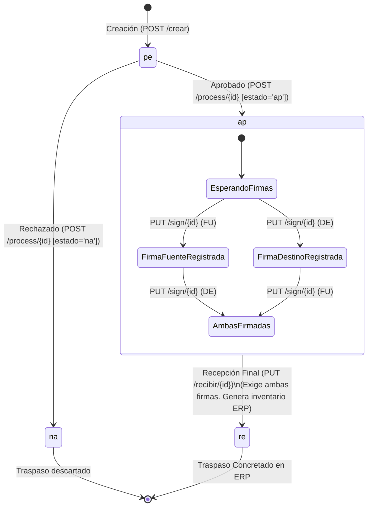

# Documentación Funcional: Módulo de Traspasos de Activos

**Ubicación de Referencia (UI):** Dashboard Principal -> "Generar solicitud de traspaso", "Aprobación de Traspasos", "Entrega / Recepción".  
**Versión:** 2.0 (Arquitectura Multi-Artículo y 4 Estados)  
**Fecha:** Septiembre 2026  

---

## 1. Propósito General del Módulo

El Módulo de Traspasos gestiona el ciclo de vida completo de la transferencia de activos fijos entre empleados y bodegas de la organización. Garantiza:
- **Agrupación Multi-Artículo:** Un único trámite (`numeroTramite` / `MOTRNUTR`) permite trasladar uno o múltiples activos bajo el mismo documento de requisición.
- **Autorización Formal:** Control de revisión jerárquica mediante aprobación o rechazo con motivo obligatorio.
- **Custodia Digital Desacoplada:** Registro de firmas manuscritas (`FU` Fuente y `DE` Destino) sin restricción de orden de precedencia.
- **Afectación Diferida de Inventario:** El inventario contable y físico en el ERP (`DOCUINVE` y `MOVIINVE`) se genera de manera estricta al confirmar la recepción final una vez registradas ambas firmas.

---

## 2. Permisos y Control de Acceso (RBAC)

El acceso a las distintas etapas se rige dinámicamente por los permisos del usuario en sesión:

| Subflujo / Pantalla | Permiso / Condición | Código Forma | Componente UI |
|---|---|---|---|
| **Generación de Traspasos** | Solicitar traspaso | `agst` | `InventoryScreen` -> `TransferFormWidget` |
| **Aprobación de Traspasos** | Aprobar / rechazar solicitudes | `aatr` | `TransferApprovalScreen` |
| **Entrega y Recepción** | Usuario asignado como entrega (FU) o recibe (DE) | Sesión activa (`AuthProvider.currentCedula ?? AuthProvider.currentUsername`) | `TransferDeliveryScreen` -> `SignatureCaptureScreen` |

---

## 3. Máquina de Estados del Traspaso (4 Estados Oficiales)

El trámite en la entidad `FI_MOVITRAS` transiciona a través de los siguientes estados canónicos:

### Catálogo de Estados

| Código | Estado | Descripción Funcional | Acción Siguiente |
|:---:|---|---|---|
| `pe` | **Pendiente** | Traspaso registrado, pendiente de revisión administrativa. | Aprobar (`ap`) o Rechazar (`na`) |
| `ap` | **Aprobado** | Autorizado formalmente. Habilitado para que las partes firmen. No afecta inventario aún. | Firmas independientes (`FU` y `DE`) |
| `na` | **Rechazado** | Cancelado administrativamente con motivo de rechazo obligatorio. | Fin del flujo |
| `re` | **Recibido** | Ambas partes han firmado, se genera el documento de inventario en el ERP y se concluye el traspaso. | Proceso concluido |
| *(pr)* | **Procesados** | Código de consulta en bandeja que agrupa trámites en `ap`, `na` y `re`. | Solo lectura |

---

## 4. Subflujos Operativos

### 4.1 Subflujo 1: Generación de Solicitudes (Multi-Artículo Guiado)

**Rol:** Usuario custodio o administrador de inventario con permiso `agst`.  
**Puntos de Entrada:**
- Botón *"Generar Solicitud de Traspaso"* en Dashboard Principal (Modo Estándar).
- Menú contextual / acción individual `⇄` en `InventoryScreen` (Modo Contextualizado Compacto).
- Selección múltiple interactiva en `InventoryScreen` (Modo Contextualizado Compacto).
- Sugerencia de traspaso desde `AssetVerificationScreen`.

#### Modos de Operación de la Interfaz (`TransferFormWidget`)
1. **Modo Estándar Guiado (`_isContextualized: false`):**
   - Invocado desde el Dashboard sin contexto previo.
   - El usuario selecciona paso a paso: Empresa → Bodega Origen → Colaborador Fuente → Activos asignados → Bodega Destino → Colaborador Destino.
2. **Modo Contextualizado Compacto (`_isContextualized: true`):**
   - Invocado directamente desde la pantalla de inventario con 1 o más artículos seleccionados (`ArticleModel`).
   - **Origen Fijo e Inmutable:** Muestra una tarjeta compacta informativa con la empresa, bodega y colaborador origen ya resueltos. No permite alterar el origen para evitar discrepancias con el inventario filtrado.
   - **Tarjeta Compacta Desplegable de Activos (`_buildCompactAssetsCard`):** Presenta un componente interactivo (`_isSelectedAssetsExpanded`) que permite expandir y consultar detalles de los ítems (código, placa, nombre) de forma minimalista.
   - **Pre-carga Inmediata (Tolerancia a Latencia):** Los artículos seleccionados se convierten en memoria e inyectan vía `TransferFormProvider.addPreselectedAsset()` antes de las consultas de red, garantizando feedback visual instantáneo sin parpadeos de "0 activos".
   - **Foco Operativo:** El usuario solo necesita seleccionar la Bodega y Colaborador Destino, y redactar las observaciones.

#### Reglas de Negocio y Validación del Endpoint de Creación:
1. **Selección de Empresa:** Restringe bodegas y se propaga en todas las consultas subsiguientes.
2. **Selección de Colaboradores:**
   - Origen consultado vía `GET /api/v1/traspasos/personas?bodega={bodega}&empresa={empresa}`.
   - **Regla de Personas Distintas:** La Persona Destino no puede ser igual a la Persona Fuente (`personaDestino != personaFuente`). Spring Boot valida y rechaza con `code: -1` (*"La persona fuente y la persona destino no pueden ser la misma"*).
3. **Selección y Límites de Activos:**
   - **Rango Permitido:** Mínimo 1 y máximo 50 artículos por solicitud de traspaso.
   - **No Duplicados:** No se permiten artículos repetidos en la lista (`code: -1`).
   - **Regla de Bloqueo por Trámite (`enTramite: true`):** Si un activo ya está en trámite pendiente (`pe`) o aprobado (`ap`), queda inhabilitado con aviso visual.
   - **Regla de Compatibilidad PL/SQL (`PKG_FI_MOVITRAS.pro_crear_solicitud`):** La base de datos exige que todos los activos compartan el mismo `centroInformacion` y `tercero`. Cuando se consultan desde `/api/v1/traspasos/activos`, el provider valida que coincidan. Si los activos provienen precargados de inventario (`ArticleModel`), donde dichos campos son `null`, el cliente no bloquea la compatibilidad y confía en la resolución de base de datos.
4. **Contrato de Envío (`POST /api/v1/traspasos/crear`):**
   - **Cuerpo JSON:** Envía `empresa`, `personaFuente`, `personaDestino`, `articulos: [ { articulo, placa } ]`, `observacion` y `tipoMovimiento: null`.
   - **Exclusión de Bodegas, CI y Terceros:** El endpoint **no recibe** bodegas, ni centro de información, ni tercero. Las bodegas solo se usan en el cliente para filtrar colaboradores.
   - **Normalización de Placa:** Si el activo no posee placa, se envía `null` (el backend lo normaliza a `"."`).
5. **Estructura de Respuesta del Trámite (`TransferCreatedResponse`):**
   - `object.id`: Número de Trámite en SigoAPP (`MOTRNUTR`). Identificador único para el ciclo de vida del traspaso.
   - `object.numeroDocumento`: Consecutivo asignado por el ERP para la requisición (`RESUNUME`), visible para el usuario.
   - `object.tipoDocumento`: Tipo de documento generado en ERP (ej. `"REQU"`).
   - `object.empresaDocumento`: Código de empresa del documento (ej. `"01"`).

---

### 4.2 Subflujo 2: Aprobación y Rechazo de Traspasos

**Rol:** Líder o Jefe de Inventario con permiso `aatr`.  
**Punto de Entrada:** Tarjeta *"Aprobación de Traspasos"* en el Dashboard.

**Comportamiento y Reglas:**
1. **Bandeja Enriquecida y Resolución Concurrente:**
   - La pantalla consulta `GET /api/v1/traspasos/list?estado=pe` (o `estado=pr` para procesados), con filtros opcionales de `empresa` y `bodega`. Devuelve la envoltura ligera `ObjectListResponse` (`id`, `tipoDocumento`, `numeroDocumento`, `fechaCreacion`).
   - `HttpTransferRepository` consulta concurrentemente los detalles llamando a `GET /api/v1/traspasos/get/{id}` para obtener artículos y cédulas crudas de personas.
   - **Enriquecimiento Concurrente (`Future.wait`)**: `TransferApprovalProvider` ejecuta en paralelo la resolución de:
     - Nombres de Colaboradores: Vía `CatalogRepository.searchEmployees(cedula: ...)` formateando como `Nombre Apellido (Cédula)`.
     - Descripciones Oficiales de Artículos: Vía `TransferRepository.getAssetsByPerson(persona: ...)` asignando la descripción encontrada (`asset.nombre`) al campo `nombre` de `TransferArticleItem`.
     - Bodegas autorizadas por división para colaboradores.
   - **Optimización con Caché en Memoria por Lote**: Se extraen los colaboradores únicos por lote antes de disparar las consultas; las respuestas se almacenan en `_personsNameCache`, `_assetsByPersonCache` y `_personWarehouseCache`, evitando peticiones repetidas ante cédulas recurrentes.
   - **Resiliencia y Fallback**: Ante fallos de red o si el backend no encuentra coincidencias, se mantiene la cédula cruda o código de activo original sin bloquear la pantalla.
2. **Visualización en UI (`TransferApprovalScreen`):**
   - **Ruta Origen/Destino (`_buildRouteRow`):** Despliega el nombre resuelto y cédula (`maxLines: 2`) sin truncamientos abruptos.
   - **Sección de Artículos (`_buildArticlesSection`):**
     - *Artículo Único:* Muestra la descripción legible en negrita (`art.nombre ?? art.articulo`), subtítulo con el código (`Código: <id>`) y badge rectangular de placa si existe.
     - *Acordeón Multi-Artículo:* Encabezado con contador y resumen (`first.nombre (first.articulo)`), y lista desplegable donde cada ítem muestra la descripción amigable, subtítulo de código y badge de placa.
3. **Acción de Aprobar:**
   - Envía `POST /api/v1/traspasos/process/{id}` con body `{ "estado": "ap", "observacion": "..." }`.
   - Transiciona el trámite al estado `ap` (autorizado para firmas).
4. **Acción de Rechazar:**
   - Despliega modal exigiendo motivo de rechazo obligatorio.
   - Envía `POST /api/v1/traspasos/process/{id}` con body `{ "estado": "na", "observacion": motivo }`.
5. **Control de Concurrencia:** `isProcessing(id)` bloquea botones y renderiza spinner durante operaciones en vuelo.
6. **Diagnóstico Técnico:** Ante fallos, muestra `DialogUtils.showErrorDialog` con el mensaje del servidor y acordeón de soporte.
7. **Diseño Visual e Identidad Institucional:** La pantalla y sus tarjetas implementan el estándar especificado en `SigoAPP_Guia_Estilos_UI.md`: AppBar sólido corporativo, franja superior métrica de conteo, panel de filtros sobrio con selectores rectangulares (`r: 8`), tarjetas blancas con franja vertical lateral de estado (5px) y botones formales (`r: 8`).

---

### 4.3 Subflujo 3: Entrega, Recepción y Firmas Digitales Desacopladas

**Rol:** Despachador (Fuente) y Receptor (Destino).  
**Punto de Entrada:** Tarjeta *"Entrega / Recepción"* en el Dashboard.

**Comportamiento y Reglas:**
1. **Listado de Asignados, Desacoplamiento de Identificadores y Enriquecimiento:**
   - Lista traspasos en estado `ap` asociados al usuario autenticado.
   - **Preservación de Custodios Originales**: `TransferRequest` deserializa y preserva `personaFuente` y `personaDestino` (cédulas de los colaboradores de la entidad `FI_MOVITRAS`), manteniendo expuestos los getters `codigoFuente` y `codigoDestino` para evitar que la resolución posterior de nombres en `responsableActual` y `responsablePropuesto` destruya los códigos numéricos originales.
   - **Identificación Dual del Colaborador en Sesión**: Para determinar la asignación del trámite y habilitar las firmas (`isDispatcher` para entrega o `isReceiver` para recepción en `TransferDeliveryScreen` y `SignatureCaptureScreen`), la aplicación evalúa conjuntamente `auth.currentCedula` y `auth.currentUsername`. El método `TransferDeliveryProvider.getAssignedTransfers(cedula, username)` coteja ambos identificadores contra las cédulas originales (`personaFuente`, `personaDestino`, `codigoFuente`, `codigoDestino`) y contra los nombres amigables resueltos.
   - **Consumo HTTP Real y Composición de ID**: `TransferDeliveryProvider` consume `HttpTransferRepository`, el cual consulta la bandeja `GET /api/v1/traspasos/list?estado=ap` y enriquece concurrentemente cada ítem invocando `GET /api/v1/traspasos/get/{id}` utilizando el ID único del trámite (`MOTRNUTR`), tolerando respuestas envueltas en `data`, `object` o directas, y poblando los detalles de artículos y firmas de la base de datos.
   - La cabecera de la tarjeta muestra `-cantidad- artículos` cuando el trámite contiene más de 1 artículo (ej. `'2 artículos'`), o el nombre oficial del activo cuando es un artículo individual.
   - En trámites multi-artículo, muestra debajo el listado de artículos incluidos con formato `${art.nombre} (${art.articulo})`.
   - Muestra los nombres resueltos en Entrega (Fuente) y Recibe (Destino).
2. **Firmas sin Orden Requerido y Habilitación de Canvas:**
   - Cualquiera de las partes puede firmar primero.
   - En `SignatureCaptureScreen`, si el usuario en sesión califica como despachador o receptor y aún no ha firmado, se habilita interactivamente el canvas manuscrito (`canSign = true`).
   - La parte despachadora registra su firma manuscrita con `tipoFirma: "FU"` (`PUT /api/v1/traspasos/sign/{id}`).
   - La parte receptora registra su firma manuscrita con `tipoFirma: "DE"` (`PUT /api/v1/traspasos/sign/{id}`).
   - Las firmas se gestionan en la entidad `FI_MOTRFIRM` y no modifican el estado `ap` del trámite.
3. **Recepción Final en ERP (`re`):**
   - Una vez que ambas firmas están capturadas (`bothSigned: true`), la UI habilita el botón destacado **"Confirmar Recepción ERP"**.
   - Invoca `PUT /api/v1/traspasos/recibir/{id}`, asentando cabeceras en `DOCUINVE` y líneas en `MOVIINVE`, cambiando el estado a `re`.
   - **Regla de Bodegas de Tipo Personal (`PE`)**: En el procedimiento de base de datos Oracle (`PKG_FI_MOVITRAS`), la afectación de existencias exige que tanto la bodega fuente como la bodega destino sean de tipo Personal (`PE`) (custodios individuales). Si alguna bodega asociada es de tipo físico (`FI`), la base de datos abortará con `ORA-20008: ... Bodega Destino [...] o Bodega Fuente [...] Deben ser de Tipo Personal`.
   - **Sanitización Inteligente y Desacoplamiento de Errores**: Si la confirmación de recepción falla por validación de Oracle o error de servidor, `HttpTransferRepository` procesa la respuesta en una `TransferBusinessException` desacoplando dos mensajes:
     - `friendlyMessage`: Extrae mediante `DialogUtils.extractFriendlyMessage` la causa concisa de negocio (ej. `"Bodega Destino [2612] o Bodega Fuente [F571] Deben ser de Tipo Personal"`), presentándola en el cuerpo principal del modal.
     - `technicalDetails`: Almacena la traza cruda completa (código ORA, stack trace de base de datos).
     - La pantalla `TransferDeliveryScreen` despliega `DialogUtils.showErrorDialog`, manteniendo la interfaz responsiva y resguardando la traza técnica y el código HTTP dentro del acordeón expandible para desarrollador.

---

## 5. Contratos de API REST (Spring Boot)

Todos los endpoints requieren cabecera `Authorization: Bearer <token>`.

| Operación | Método | Endpoint | Parámetros / Body | Respuestas |
|---|:---:|---|---|---|
| **Bodegas Personales** | `GET` | `/api/v1/bodegas/empresa/{empresa}/PE` | Path: `{empresa}` (código empresa) Path: `PE` (tipo personal obligatorio) | `200 OK` `List<WarehouseModel>` (`codigoBodega`, `descripcionBodega`, `estadoBodega`) |
| **Colaboradores por Bodega** | `GET` | `/api/v1/traspasos/personas` | Query: `?bodega={BOD}&empresa={EMP}` *(Regla: exige bodega tipo `'PE'`; si se envía bodega física `'FI'` retorna `[]` por filtro SQL `AND B.BODETIBO = 'PE'`)* | `200 OK` `{ "list": [ { "cedula": "...", "nombre": "...", "apellido": "..." } ] }` |
| **Activos por Responsable** | `GET` | `/api/v1/traspasos/activos` | Query: `?persona={CED}&empresa={EMP}` | `200 OK` `{ "list": [ { "articulo": "...", "placa": "...", "nombre": "...", "centroInformacion": "...", "tercero": "...", "enTramite": bool } ] }` |
| **Crear Traspaso** | `POST` | `/api/v1/traspasos/crear` | Body: `TransferRequest` (JSON multi-artículo) | `200 OK` `{ "code": 0, "msg": "...", "object": { "id": 1045, "numeroDocumento": 85023, ... } }` `200 OK` con `code: -1` (validación de negocio) `400 Bad Request` |
| **Bandeja de Trámites** | `GET` | `/api/v1/traspasos/list` | Query: `?estado={pe|pr}&empresa={EMP}&bodega={BOD}` | `200 OK` (lista ligera `ObjectListResponse` con `id`, `tipoDocumento`, `numeroDocumento`, `fechaCreacion`) |
| **Detalle Completo** | `GET` | `/api/v1/traspasos/get/{id}` | Path: `id` (número de trámite `MOTRNUTR`) | `200 OK` (objeto con `articulos` y `firmas`) `404 Not Found` |
| **Procesar (Aprobar/Rechazar)** | `POST` | `/api/v1/traspasos/process/{id}` | Path: `id` Body: `{ "estado": "ap"|"na", "observacion": "..." }` | `200 OK` `400 Motivo obligatorio si na` |
| **Registrar Firma** | `PUT` | `/api/v1/traspasos/sign/{id}` | Path: `id` Body: `{ "tipoFirma": "FU"|"DE", "firma": "data:image/..." }` | `200 OK` |
| **Confirmar Recepción ERP** | `PUT` | `/api/v1/traspasos/recibir/{id}` | Path: `id` Sin body requerido | `200 OK` (estado `re` en ERP) `400 Exige ambas firmas` |

### 5.1 Especificación Detallada: `POST /api/v1/traspasos/crear`

#### Body de Entrada (`TransferRequest` / `TransferCreateRequest`)
| Campo | Tipo | Obligatorio | Máx | Descripción y Reglas |
|---|---|:---:|---|---|
| `empresa` | `string` | Sí | 6 car. | Código de la empresa propietaria (ej. `"01"`). |
| `personaFuente` | `string` | Sí | 20 car. | Cédula del colaborador actual que entrega (`PERSCODI`). |
| `personaDestino` | `string` | Sí | 20 car. | Cédula del colaborador que recibe. No puede ser igual a `personaFuente`. |
| `articulos` | `array` | Sí | 1-50 ítems | Colección de activos a trasladar. Sin duplicados. |
| `articulos[].articulo` | `string` | Sí | 20 car. | Código del activo en inventario (`ACFIARTI`). |
| `articulos[].placa` | `string?` | No | 20 car. | Placa física. Enviar `null` si carece de placa (el backend normaliza a `"."`). |
| `observacion` | `string` | Sí | 500 car. | Justificación del traslado. |
| `tipoMovimiento` | `string?` | No | 4 car. | Tipo doc ERP. Si se envía `null`, la BD lo resuelve automáticamente. |

#### Matriz de Errores y Validaciones
| Nivel | Estado HTTP | Código / Mensaje | Causa / Comportamiento en Front |
|---|:---:|---|---|
| **Negocio Previo** | `200 OK` | `{ "code": -1, "msg": "La persona fuente y la persona destino no pueden ser la misma" }` | Bloqueado preventivamente por validación en `TransferFormProvider`. |
| **Negocio Previo** | `200 OK` | `{ "code": -1, "msg": "Un traspaso no puede incluir mas de 50 articulos" }` | Superó el límite por lote permitido. |
| **Negocio Previo** | `200 OK` | `{ "code": -1, "msg": "El articulo <COD> esta repetido en la solicitud" }` | Array con artículos repetidos. Prevenido por UI. |
| **Formato** | `400 Bad Request` | `@NotBlank`, campos vacíos o tamaño excedido. | Error de validación estructural. Capturado en `DioException`. |
| **PL/SQL Oracle** | `200 OK` / `500` | Mensaje Oracle de `PKG_FI_MOVITRAS.pro_crear_solicitud` | Discrepancia de CI/Tercero o activo en trámite previo (`pe`/`ap`). |

### 5.2 Modelo de Datos en Cliente (`TransferArticleItem` y `TransferRequest`)

#### Estructura de `TransferArticleItem`
- `articulo` (`String`): Código del artículo en inventario.
- `placa` (`String?`): Placa física del artículo (opcional).
- `nombre` (`String?`): Descripción amigable y oficial del artículo (opcional). Soporta mapeo tolerante desde `nombre`, `descripcion` y `nombreElemento` en `fromJson`.

#### Estructura y Getters Inteligentes en `TransferRequest`
- `personaFuente` (`String?`): Cédula o identificador original del colaborador que entrega (`PERSCODI`), deserializado y preservado de la entidad `FI_MOVITRAS`.
- `personaDestino` (`String?`): Cédula o identificador original del colaborador que recibe, deserializado y preservado de la entidad `FI_MOVITRAS`.
- `codigoFuente`: Getter que retorna prioritariamente `personaFuente` o en su defecto `responsableActual`.
- `codigoDestino`: Getter que retorna prioritariamente `personaDestino` o en su defecto `responsablePropuesto`.
- `nombreArticulo`: Prioriza la descripción oficial del primer artículo (`articulos.first.nombre`), retornando `${displayFirst} (+N artículos más)` para trámites multi-artículo o la descripción directa para trámites unitarios. Mantiene fallbacks para trámites legacy o números de documento.
- `idArticulo`: Código de activo del primer ítem o ID de trámite como fallback.
- `placa`: Placa física del primer artículo si existe.
- `bothSigned`: Booleano que confirma si tanto la parte despachadora (`isSourceSigned`) como la receptora (`isTargetSigned`) han registrado sus respectivas firmas.
